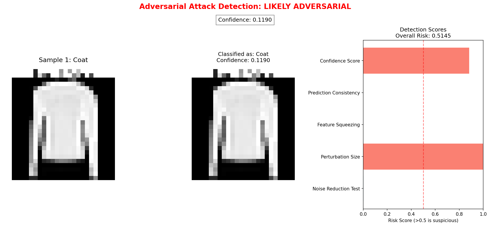

# Adversarial Attack Detector

This tool analyzes images to detect potential adversarial attacks on deep learning models. It uses multiple detection methods to identify suspicious manipulations designed to fool neural networks.

## Analyze Your Own Image ⚡

The quickest way to analyze your own image:

```bash
./upload_and_check.sh
```

Or directly specify your image path:

```bash
./upload_and_check.sh /path/to/your/image.jpg
```

You can also drag and drop your image file from your file explorer directly into the terminal!

## Advanced Visualization 📊

All analyses now feature our advanced visualization format:



Each visualization includes:
- Original image display
- Classification details (class and confidence)
- Detection scores from multiple methods
- Overall risk assessment
- Clear indication if an adversarial attack was detected

## Quick Start

1. **Setup sample images**:
   ```bash
   ./detect.sh --setup
   ```

2. **Run the detector with advanced visualization**:
   ```bash
   ./upload_and_check.sh test_images/adversarial_tshirt.png
   ```

3. **Analyze multiple images**:
   ```bash
   ./check_directory.sh test_images
   ```

4. **Try interactive mode**:
   ```bash
   ./upload_and_check.sh
   ```

5. **Browse and analyze dataset images**:
   ```bash
   ./detect.sh --dataset
   ```

## Features

- Detect adversarial attacks on images using multiple detection methods
- Supports various image formats (JPG, PNG, BMP, etc.)
- Processes any image by converting to grayscale and resizing
- Advanced visualizations of detection results in a clear, informative format
- Provides detailed risk scores and assessment
- Easy image uploading with drag & drop support
- Directory scanning for batch analysis
- Dataset browser for analyzing Fashion MNIST samples
- Ability to generate adversarial examples

## Detection Methods

1. **Confidence Score**: Analyzes model prediction confidence, as adversarial examples often have lower confidence
2. **Prediction Consistency**: Tests if predictions change with small noise additions
3. **Feature Squeezing**: Reduces color depth and checks for prediction changes
4. **Perturbation Size**: Estimates the magnitude of potential adversarial perturbations
5. **Noise Reduction**: Tests if denoising changes model predictions

## Usage

### Interactive Mode (Easiest Method)

The simplest way to use the detector is in interactive mode:

```bash
./upload_and_check.sh
```

At the prompt, you can simply drag and drop your image file from your file explorer into the terminal.

### Directory Scanner

To scan and analyze multiple images at once:

```bash
./check_directory.sh /path/to/your/images
```

This will analyze all images in the directory and provide a summary report with visualizations.

### Dataset Browser

To browse and analyze images from the Fashion MNIST dataset:

```bash
./detect.sh --dataset
```

This opens an interactive browser where you can:
- View sample images from the dataset
- Analyze specific samples for adversarial characteristics
- Generate adversarial versions of dataset images
- Compare original and adversarial versions
- **Analyze your own images from any directory**

You can also list and analyze samples directly:

```bash
# List 20 sample images
./detect.sh --dataset --list 20

# Analyze sample #5
./detect.sh --dataset --sample 5

# Generate and analyze an adversarial version of sample #3
./detect.sh --dataset --sample 3 --adversarial
```

### Command Line

To analyze a specific image directly with advanced visualization:

```bash
./upload_and_check.sh path/to/your/image.jpg
```

### Evaluation Mode

To evaluate detector performance on test data:

```bash
./detect.sh --evaluate --samples 10
```

This will generate and test adversarial examples, creating ROC and precision-recall curves.

## Output

Detection results include:
- Predicted class and confidence
- Individual detection method scores
- Overall risk score (0-1 scale)
- Assessment (LIKELY CLEAN or LIKELY ADVERSARIAL)
- Advanced visualization of the results

Results are saved to the `docs` directory.

## Having Trouble?

We've created two guides to help you:

- `UPLOAD_GUIDE.md` - Quick guide for uploading and analyzing your images
- `USER_GUIDE.md` - Detailed instructions with troubleshooting tips

## Requirements

- TensorFlow 2.x
- NumPy
- Matplotlib
- scikit-image
- scikit-learn
- PIL/Pillow

## Examples

### Command Line Example

```bash
./upload_and_check.sh test_images/adversarial_tshirt.png
```

### Interactive Mode Example

```
Enter path to image file (or 'q' to quit): test_images/clean_tshirt.png

Analyzing image: test_images/clean_tshirt.png
Processing...

Results Summary:
  - Predicted class: Sneaker (Class 7)
  - Confidence: 0.1139
  - Risk score: 0.4883
  - Assessment: LIKELY CLEAN

Detailed visualization saved to: docs/clean_tshirt_detection.png
```

## Understanding Risk Scores

- Risk score < 0.5: Likely a clean, unmodified image
- Risk score ≥ 0.5: Potential adversarial manipulation detected

Higher risk scores indicate stronger evidence of adversarial attacks.


